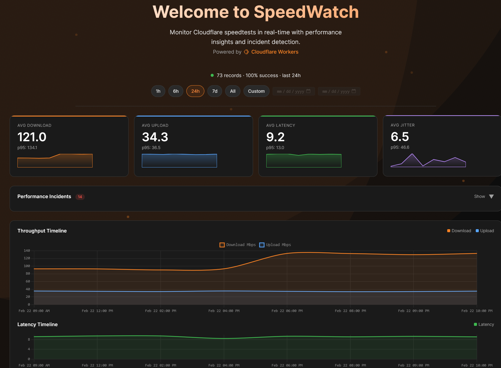

# SpeedWatch

Real-time Cloudflare speedtest monitoring dashboard powered by R2 object storage.

## Overview

SpeedWatch reads JSON speedtest result files from an R2 bucket and displays them through a REST API consumed by an interactive Astro UI.



```
Cloudflare Worker (speedwatch)
         │
         ├─► /api/summary → Aggregated KPIs
         ├─► /api/results → Paginated records
         ├─► /llms.txt → AI discovery
         │
         ▼
R2 Bucket
```

## How It Works

1. **Ingestion**: Speedtest agents upload JSON results to R2 bucket
2. **Parsing**: Worker reads R2 files, parses metrics, converts bytes/sec to Mbps
3. **Aggregation**: Summarizes data by time windows, calculates percentiles, groups by endpoint
4. **Anomaly Detection**: Uses percentage-of-baseline to flag deviations
   - Compares values against median baseline
   - WARN: values below 70% of baseline (for download/upload) or above 140% (for latency/jitter)
   - CRIT: values below 50% of baseline (for download/upload) or above 200% (for latency/jitter)
   - Adapts to each user's actual connection baseline naturally
5. **Dashboard**: Renders KPIs, charts, incidents, endpoint breakdown, and results table

## Compatible Data Sources

SpeedWatch is designed to work with JSON speedtest results and is particularly well-suited for data from:

- **[netzbremse-measurement](https://github.com/AKVorrat/netzbremse-measurement/)** — A comprehensive network speed measurement tool that produces compatible JSON results. Simply upload the JSON output files to your R2 bucket to visualize them in the dashboard.

## Features

### API Endpoints

- `GET /api/summary?hours={24}` — Aggregated KPIs, percentiles, per-endpoint breakdown, hourly timeline, incidents
- `GET /api/results?limit={100}&cursor={cursor}&endpoint={name}&from={iso}` — Paginated raw test records
- `GET /llms.txt` — AI agent discoverability document

### Dashboard UI

- **KPI Cards** — Average download, upload, latency, jitter with sparklines and p95
- **Incidents Panel** — Automatic degradation detection (warn/crit) with affected metrics
- **Throughput Chart** — Download (orange) and upload (blue) area charts
- **Latency Chart** — Latency line chart
- **Endpoint Breakdown** — Per-endpoint cards with progress bars and metric tiles
- **Results Table** — Paginated table with anomaly highlighting
- **Auto-refresh** — 60-second data refresh
- **Time Range Pills** — 1h, 6h, 24h, 7d, All, Custom date range

## Configuration

### Environment Variables

All configured in `wrangler.jsonc`:

| Variable | Default | Description |
|----------|----------|-------------|
| `R2_PREFIX` | `"speedtest-results/"` | Folder path in R2 bucket |
| `CACHE_TTL_SECONDS` | `"60"` | Response cache duration |
| `MAX_RESULTS_PER_PAGE` | `"200"` | Max records per results page |

### Anomaly Detection Configuration

Anomaly detection is fully configurable via environment variables:

| Variable | Default | Description |
|----------|----------|-------------|
| `ANOMALY_WARN_THRESHOLD` | `"0.70"` | Warning threshold as fraction of baseline (0.70 = warn if below 70% of baseline) |
| `ANOMALY_CRIT_THRESHOLD` | `"0.50"` | Critical threshold as fraction of baseline (0.50 = warn if below 50% of baseline) |

**How Baseline Detection Works:**

1. Calculate median from recent records (last 100 for results table, all records for endpoints)
2. For throughput (download/upload): WARN if value < WARN_THRESHOLD × baseline, CRIT if value < CRIT_THRESHOLD × baseline
3. For latency/jitter: WARN if value > baseline / WARN_THRESHOLD, CRIT if value > baseline / CRIT_THRESHOLD
4. Automatically adapts to each user's actual connection performance

**Example with defaults:**
- Throughput: WARN if below 70% of baseline, CRIT if below 50% of baseline
- Latency/Jitter: WARN if above 142% of baseline (1/0.70), CRIT if above 200% of baseline (1/0.50)

**To customize:**
1. Go to Cloudflare Dashboard → Workers & Pages
2. Select your `speedwatch` Worker
3. Settings → Variables
4. Add/update any of the variables above
5. Save to trigger redeployment

### Bindings

| Binding | Type | Value |
|---------|------|--------|
| `R2_BUCKET` | R2 Bucket | Your speedtest results bucket |
| `RATE_LIMITER` | Rate Limit | 60 requests per 60s |

## R2 Bucket Data Format

### File Naming

Supported patterns:
- `speedtest-{timestamp}.json` — Default pattern
- `{timestamp}.json` — Without prefix

### File Content

```json
{
  "sessionID": "2683d050-da44-458d-9257-360c143f8af8",
  "endpoint": "https://custom-t0.speed.cloudflare.com",
  "success": true,
  "result": {
    "download": 71965572.58,      // bytes/sec
    "upload": 35293340.94,        // bytes/sec
    "latency": 7.50,              // ms
    "jitter": 1.21,               // ms
    "downLoadedLatency": 22.80,    // ms
    "downLoadedJitter": 6.72,      // ms
    "upLoadedLatency": 51.50,      // ms
    "upLoadedJitter": 14.26        // ms
  }
}
```

**Note:** API converts bytes/sec to Mbps automatically.

## Deployment

### Prerequisites

- Cloudflare account with Workers enabled
- GitHub account (for Workers Builds integration)
- Existing R2 bucket with speedtest JSON files

### Workers Builds (Recommended)

Workers Builds automatically deploys on push to `main`.

1. Go to [Cloudflare Dashboard](https://dash.cloudflare.com/)
2. **Workers & Pages** → **Create Application**
3. **Connect to Git** → Authorize GitHub → Select `speedwatch` repo
4. Click **Begin setup**
5. Build settings (pre-configured):
   - Build command: `npm install && npm run build`
   - Deploy command: `npx wrangler deploy`
6. Click **Save and Deploy**

### Local Development

```bash
npm install
npm run dev
```

Dev server runs on `http://localhost:8787/`

## Troubleshooting

| Issue | Fix |
|--------|------|
| Dashboard empty | Upload speedtest JSON files to R2 bucket |
| `R2_BUCKET` binding error | Verify bucket name in `wrangler.jsonc` matches actual bucket |
| API rate limited | Wait 60s or adjust `RATE_LIMITER` |
| Build fails | Run `npm run typecheck` to check for errors |

## License

MIT
