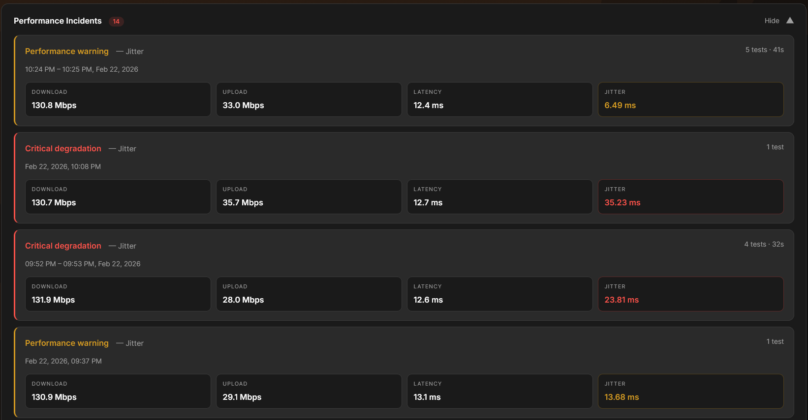
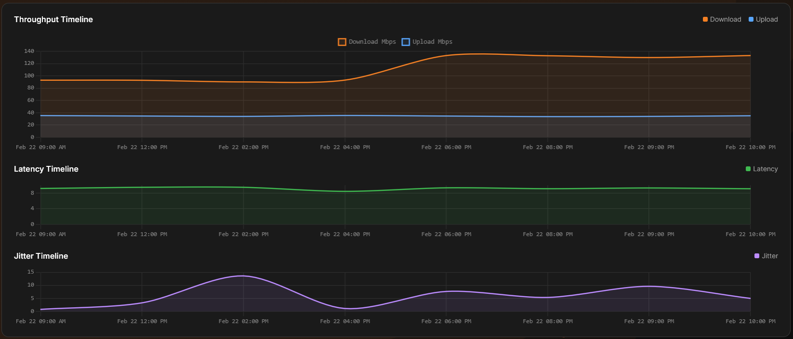
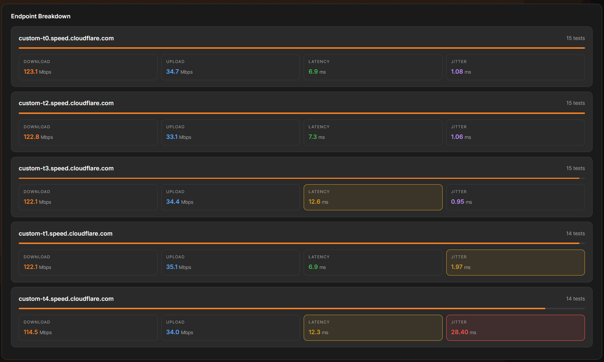
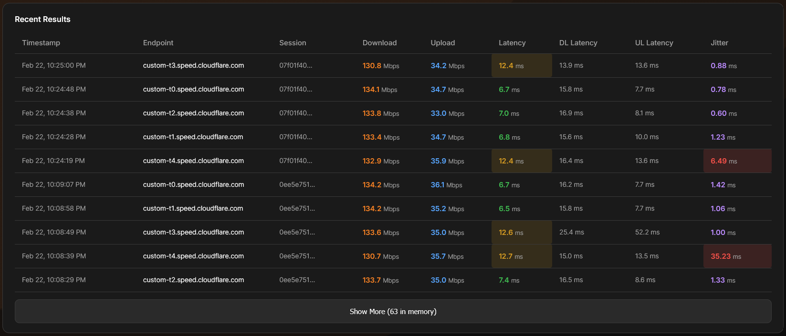

# SpeedWatch

Real-time Cloudflare speedtest monitoring dashboard powered by R2 object storage.

## Overview

SpeedWatch reads JSON speedtest result files from an R2 bucket and displays them through a REST API consumed by an interactive Astro UI.


```
Cloudflare Worker (speedwatch)
         │
         ├─► /api/summary → Aggregated KPIs, incidents, timeline, endpoint breakdown
         ├─► /api/results → Paginated raw records
         ├─► /api/config  → Runtime threshold configuration
         ├─► /llms.txt    → AI discovery
         │
         ▼
R2 Bucket (JSON files, one per speedtest run)
```

## How It Works

1. **Ingestion**: Speedtest agents upload JSON results to an R2 bucket
2. **Parsing**: Worker reads R2 files, parses metrics, converts bytes/sec to Mbps
3. **Aggregation**: Summarises data by time windows, calculates percentiles (p50/p95/p99), groups by endpoint
4. **Anomaly Detection**: Dual-gate model — a value is only flagged if it exceeds *both* a relative deviation threshold *and* an absolute floor (see [Anomaly Detection](#anomaly-detection) below)
5. **Incident Detection**: Consecutive CRIT-level records are merged into a single incident card; warn-level runs do not surface as incidents
6. **Dashboard**: Renders KPIs, charts, incidents, endpoint breakdown, and results table

## Compatible Data Sources

SpeedWatch is designed to work with JSON speedtest results and is particularly well-suited for data from:

- **[netzbremse-measurement](https://github.com/AKVorrat/netzbremse-measurement/)** — A comprehensive network speed measurement tool that produces compatible JSON results. Simply upload the JSON output files to your R2 bucket to visualise them in the dashboard.

## Features

### API Endpoints

- `GET /api/summary?hours={24}` — Aggregated KPIs, percentiles, per-endpoint breakdown, hourly timeline, incidents
- `GET /api/results?limit={100}&cursor={cursor}&endpoint={name}&from={iso}` — Paginated raw test records
- `GET /api/config` — Runtime configuration including relative thresholds and absolute floors
- `GET /llms.txt` — AI agent discoverability document

### Dashboard UI

- **KPI Cards** — Average download, upload, latency, jitter with sparklines and p95
- **Incidents Panel** — Critical-only degradation incidents with affected metrics highlighted



- **Throughput Chart** — Download (orange) and upload (blue) area charts
- **Latency Chart** — Latency line chart
- **Jitter Chart** — Jitter line chart



- **Endpoint Breakdown** — Per-endpoint cards with progress bars and metric tiles



- **Results Table** — Paginated table with anomaly highlighting



- **Auto-refresh** — 60-second data refresh
- **Time Range Pills** — 1h, 6h, 24h, 7d, All, Custom date range

## Anomaly Detection

SpeedWatch uses a **dual-gate model** for flagging values in the Results table and Endpoint Breakdown. A value is only highlighted if it clears *both* gates simultaneously:

| Gate | Description |
|------|-------------|
| **Relative** | The value deviates significantly from the median of the last 100 records |
| **Absolute floor** | The value also exceeds a minimum threshold that represents objectively degraded performance |

This prevents false positives on excellent connections — e.g. a jitter of 2ms will never be flagged red simply because the session median happens to be 0.5ms.

### Absolute Floors

Defined in `src/types.ts` and served via `/api/config`:

| Metric | Warn floor | Crit floor |
|--------|-----------|-----------|
| Download | 50 Mbps | 25 Mbps |
| Upload | 20 Mbps | 10 Mbps |
| Latency | 20 ms | 50 ms |
| Jitter | 5 ms | 15 ms |

### Relative Thresholds

| Variable | Default | Meaning |
|----------|---------|---------|
| `ANOMALY_WARN_THRESHOLD` | `0.70` | Throughput warn if < 70% of median; latency/jitter warn if > 1/0.70 ≈ 143% of median |
| `ANOMALY_CRIT_THRESHOLD` | `0.50` | Throughput crit if < 50% of median; latency/jitter crit if > 1/0.50 = 200% of median |

Both thresholds are configurable via environment variables (see [Configuration](#configuration)).

### Performance Incidents

Incidents are constructed on the backend from raw records using fixed absolute/ratio thresholds (`classifyRecord()` in `src/types.ts`). Only **CRIT-level** runs surface as incident cards — consecutive warn-level records do not create incidents. The metric tiles inside each incident card highlight exactly the metrics that contributed to the critical classification.

## Configuration

### Environment Variables

All configured in `wrangler.jsonc`:

| Variable | Default | Description |
|----------|---------|-------------|
| `R2_PREFIX` | `"speedtest-results/"` | Folder path prefix in R2 bucket |
| `CACHE_TTL_SECONDS` | `"60"` | KV response cache duration in seconds |
| `MAX_RESULTS_PER_PAGE` | `"200"` | Maximum records returned per results page |
| `ANOMALY_WARN_THRESHOLD` | `"0.70"` | Relative warn threshold (fraction of median baseline) |
| `ANOMALY_CRIT_THRESHOLD` | `"0.50"` | Relative crit threshold (fraction of median baseline) |

**To customise thresholds:**
1. Go to Cloudflare Dashboard → Workers & Pages
2. Select your `speedwatch` Worker
3. Settings → Variables
4. Add/update the variable and save to trigger redeployment

### Bindings

| Binding | Type | Value |
|---------|------|-------|
| `R2_BUCKET` | R2 Bucket | Your speedtest results bucket |
| `RATE_LIMITER` | Rate Limit | 60 requests per 60s |

## R2 Bucket Data Format

### File Naming

Supported patterns:
- `speedtest-{timestamp}.json` — Default pattern
- `{timestamp}.json` — Without prefix

### File Content

```json
{
  "sessionID": "2683d050-da44-458d-9257-360c143f8af8",
  "endpoint": "https://custom-t0.speed.cloudflare.com",
  "success": true,
  "result": {
    "download": 71965572.58,       // bytes/sec — converted to Mbps automatically
    "upload": 35293340.94,         // bytes/sec — converted to Mbps automatically
    "latency": 7.50,               // ms
    "jitter": 1.21,                // ms
    "downLoadedLatency": 22.80,    // ms
    "downLoadedJitter": 6.72,      // ms
    "upLoadedLatency": 51.50,      // ms
    "upLoadedJitter": 14.26        // ms
  }
}
```

## Deployment

### Prerequisites

- Cloudflare account with Workers enabled
- GitHub account (for Workers Builds integration)
- Existing R2 bucket with speedtest JSON files

### Workers Builds (Recommended)

Workers Builds automatically deploys on push to `main`.

1. Go to [Cloudflare Dashboard](https://dash.cloudflare.com/)
2. **Workers & Pages** → **Create Application**
3. **Connect to Git** → Authorise GitHub → Select `speedwatch` repo
4. Click **Begin setup**
5. Build settings (pre-configured):
   - Build command: `npm install && npm run build`
   - Deploy command: `npx wrangler deploy`
6. Click **Save and Deploy**

### Local Development

```bash
npm install
npm run dev
```

Dev server runs on `http://localhost:8787/`

## Troubleshooting

| Issue | Fix |
|-------|-----|
| Dashboard empty | Upload speedtest JSON files to R2 bucket |
| `R2_BUCKET` binding error | Verify bucket name in `wrangler.jsonc` matches actual bucket |
| API rate limited | Wait 60s or adjust `RATE_LIMITER` in `wrangler.jsonc` |
| Build fails | Run `npm run typecheck` to check for type errors |
| Healthy values flagged as warn/crit | The absolute floors may need tuning for your connection; update `THRESHOLDS` in `src/types.ts` |

## License

MIT
